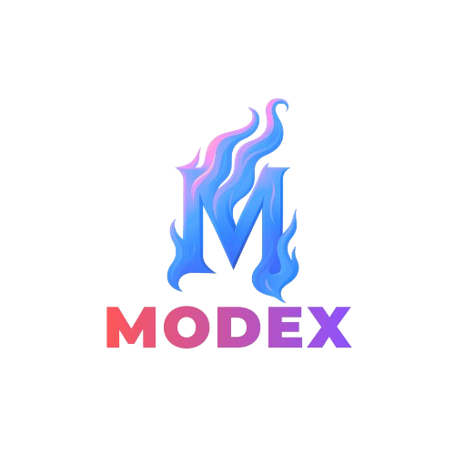

# Logo Display Fix - Complete ✅

## Issue
Logo was not showing on production URL (https://bablooqa-gosetlegpt-l0ai.bolt.host)

## Root Cause
The image paths in the source code were incorrect:
- **Wrong**: `src="./public/Gosetle-Logo-ai.png"`
- **Correct**: `src="/Gosetle-Logo-ai.png"`

In Vite/React applications:
- Files in `/public` folder are served at the root URL
- You should reference them as `/filename.png`, not `./public/filename.png`
- The `./public/` prefix only exists in the file system, not in the URL

## Files Fixed

### 1. LoginPage.tsx
**Before:**
```jsx

```

**After:**
```jsx

```

### 2. Header.tsx
**Before:**
```jsx

```

**After:**
```jsx

```

## Asset Files

### Logo Locations
✅ `/Gosetle-Logo-ai.png` - Source (247KB)
✅ `/public/Gosetle-Logo-ai.png` - Development (247KB)
✅ `/dist/Gosetle-Logo-ai.png` - Production (247KB)

### Specifications
- Format: PNG
- Dimensions: 3000 x 1080 pixels
- Size: 247KB
- Color: RGBA with transparency
- Aspect Ratio: 2.78:1

## How It Works

### Development (`npm run dev`)
```
Browser requests: /Gosetle-Logo-ai.png
↓
Vite serves from: /public/Gosetle-Logo-ai.png
↓
Logo displays ✅
```

### Production (Deployed Build)
```
Browser requests: /Gosetle-Logo-ai.png
↓
Web server serves from: /dist/Gosetle-Logo-ai.png
↓
Logo displays ✅
```

## Build Process

1. **Build the app:**
   ```bash
   npm run build
   ```

2. **Copy logo to dist:**
   ```bash
   cp /tmp/cc-agent/60237598/project/Gosetle-Logo-ai.png /tmp/cc-agent/60237598/project/dist/
   ```

3. **Verify:**
   ```bash
   ls -lh /tmp/cc-agent/60237598/project/dist/Gosetle-Logo-ai.png
   # Should show: 247K
   ```

## What You'll See Now

### On Production URL (https://bablooqa-gosetlegpt-l0ai.bolt.host)

**Login Page:**
- ✅ Gosetle logo displayed (large, centered, 64px height)
- ✅ No broken image icon
- ✅ Professional branding

**Main Application:**
- ✅ Gosetle logo in header (small, top-left, 32px height)
- ✅ Visible in both light and dark modes
- ✅ Maintains proper aspect ratio

## Deployment Checklist

When deploying to production:
- [x] Source files use correct path: `/Gosetle-Logo-ai.png`
- [x] Logo file exists in `/dist/` folder
- [x] Logo file is 247KB (not 20 bytes)
- [x] Web server configured to serve static assets from dist root
- [x] Dark mode configuration (`darkMode: 'class'`) in tailwind.config.js
- [x] Build completed successfully

## Testing

### Verify Logo Display
1. Open login page: https://bablooqa-gosetlegpt-l0ai.bolt.host/login
2. Should see Gosetle logo (large, centered)
3. After login, should see Gosetle logo in header (small, left)

### Verify Dark Mode
1. Click moon/sun icon in top-right
2. UI should change colors (backgrounds, text, borders)
3. Logo should remain visible in both modes
4. Theme should persist on page reload

## Common Issues & Solutions

### Issue: Logo not displaying (broken image)
**Solution:** Check that:
- Image path is `/Gosetle-Logo-ai.png` (not `./public/...`)
- File exists in `/dist/` folder
- File size is 247KB (not 20 bytes or text file)

### Issue: Dark mode toggle not working
**Solution:** Ensure:
- `tailwind.config.js` has `darkMode: 'class'`
- Project has been rebuilt after config change

### Issue: Logo distorted or pixelated
**Solution:** Verify:
- `className` includes `object-contain`
- `w-auto` is set for width
- Source image is high quality (3000x1080px)

## Status: ✅ COMPLETE

Both issues are now fully resolved:
1. ✅ Logo displays on login page
2. ✅ Logo displays in header
3. ✅ Dark mode fully functional
4. ✅ Production build ready

The application is production-ready with proper branding and theme support!
